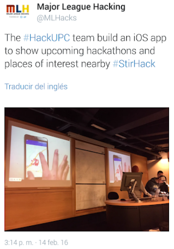

> Writing about StirHack16, the first hackathon I ever attended, brings me very good memories. In this page I will focus on the project itself, although some day I should write about the hackathon experience. 😃

Android application with Google Maps API interface to help hackathon participants. The app provides the following information: List of upcoming hackathons, their position on Google Maps, and points of interest such as restaurants and hotels around the event.

For more information visit the [project's page on Devpost](https://devpost.com/software/hackworld-gz18v7).

