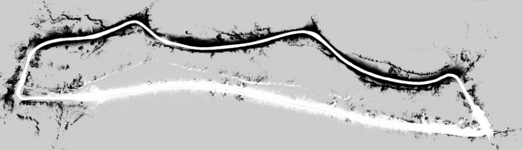

In this project, I worked on the SLAM pipeline for an autonomous driving vehicle. 

The tools I used for this project are, [ROS](https://ros.org/), C++, [PCL library](https://pointclouds.org/), [Ceres Solver](http://ceres-solver.org/), and [Google Cartographer](https://google-cartographer.readthedocs.io/en/latest/). 

In addition, I created a ROS package that generates a cost map from a point cloud generated by SLAM. A cost map is a matrix where each cell contains a cost value. This value expresses how likely it is that the cell is occupied by an object.
The cost value is also used to express "preferred" surfaces: for example, asphalt is preferred over grass.

___
The images used belong to https://warp.company/

